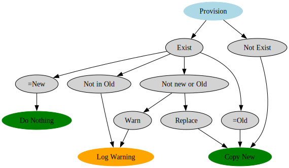

# Activate Mutable Planning

## V1 - Minimum Viable Product

```sh
activate-mutable activate [config-file] [home-directory]
```

Copy files to home so that they can be modified after NixOS activation. Don't
support directories yet, mvp is just to support files. Symlinks are immutable,
so they should not be allowed.

Config (JSON)

```ts
config: ConfigEntry[]

interface ConfigEntry {
    destination: string // Relative to home
    source: string // Absolute
    onConflict: 'replace' | 'warn'
}
```

Link previous config file after activation for future reference. If previous is
not found, treat as if it was an empty file. Store in
`~/.config/activate-mutable-config.json`.



3 possible outcomes, use an enum to represent them.

## V2 - Restore Changes to the Repo

```sh
activate-mutable torepo [repo=$FLAKE] [home-directory=$HOME]
```

Copy currently deployed files back to the repository in order to transfer
changes. Take default arguments from the environment.

How to find the repo path? Make it an option, guess from store path, or
calculate the path using Nix. Automatic would be more convenient.

If the file needs preprocessing by Nix, what then?

Current uses:

- XDG template files
- VSCode config (preprocessed, put deps on `$PATH` instead?)
- Espanso config (needs directory support)
- Game config (still in old dotfiles repo)
- VSCode snippets (needs directory support)

## V3 - Handle Directories

Apply the usual rules on a per-file basis recursively. Still don't allow any
symlinks.
